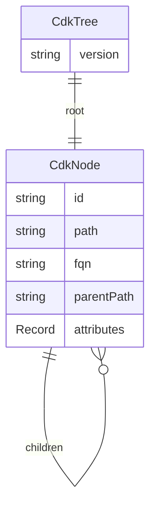
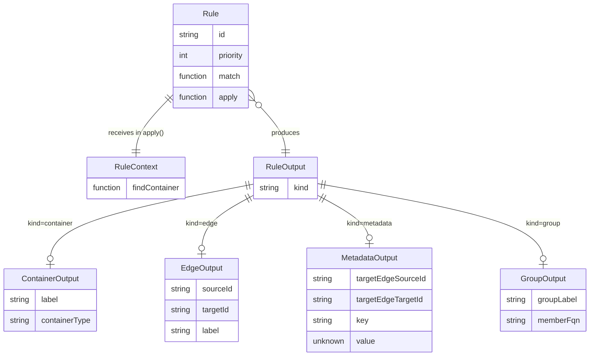
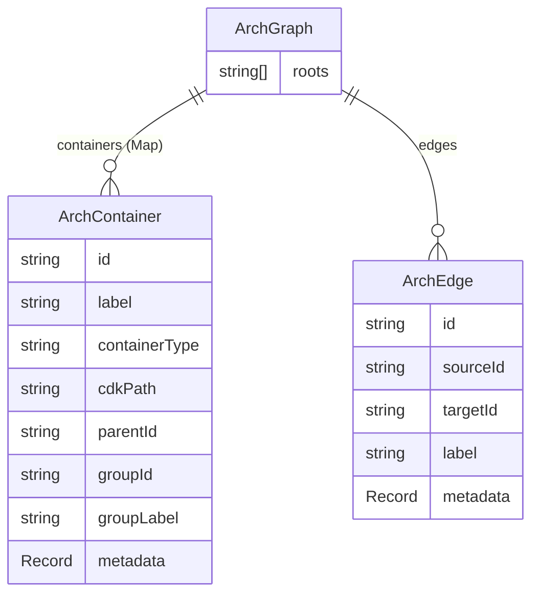
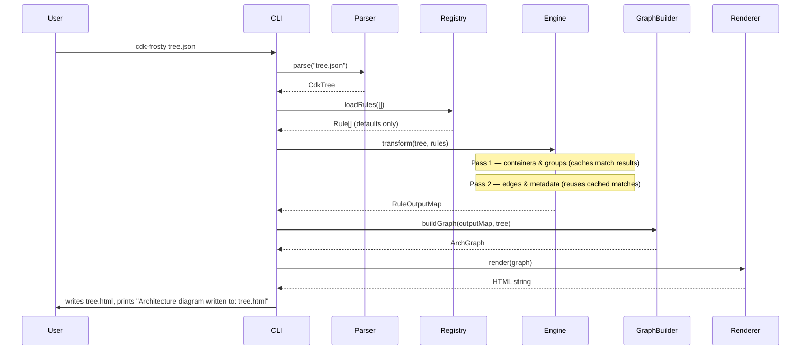
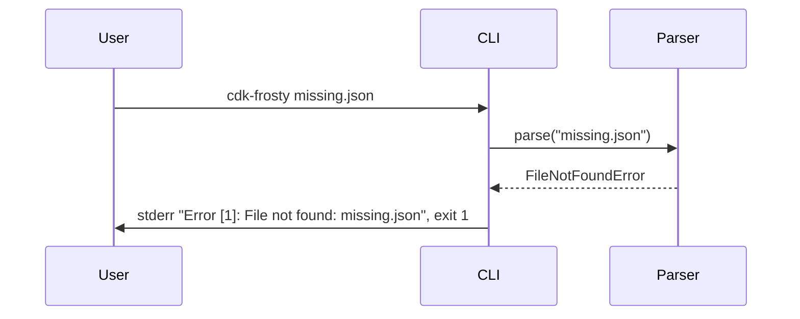
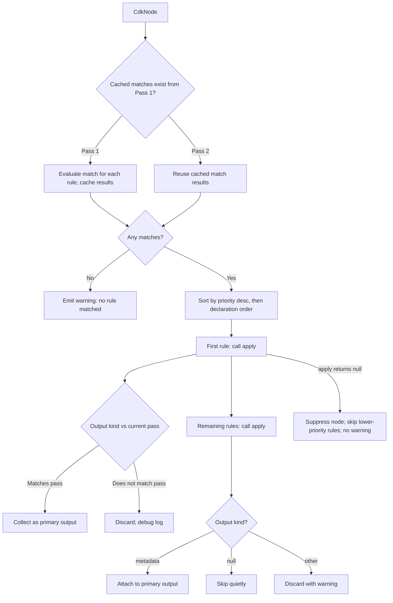

# Design

## Overview

cdk-frosty is a CLI tool implemented in TypeScript/Node.js. It reads a CDK v2 `tree.json` file, applies a prioritised rule set to transform the CDK construct tree into an architecture graph, and renders that graph as an HTML file with an embedded Mermaid diagram.

The system is structured as a four-stage linear pipeline: **parse → evaluate → build graph → render**. Each stage has a well-defined input type and output type. Rules are the sole mechanism for deciding which CDK nodes become architecture elements — the pipeline itself has no opinions about AWS constructs. Rules are JavaScript modules loaded at startup. The default ruleset covers the four constructs identified in the requirements (Lambda, SQS, IAM Role, EventSourceMapping). Users may supply additional rules via a `--rules` CLI flag.

---

## Architecture Decisions

**ADR-1: Rules are JavaScript modules, not a config DSL**

- **Context:** FR-3, FR-16 require rules to be configurable and user-authorable without recompiling the core package. FR-8 requires priority-ordered evaluation with conditional matching.
- **Alternatives considered:**
  - *JSON/YAML config:* Limited expressiveness; matching conditions beyond simple type checks require a custom DSL interpreter.
  - *JavaScript modules (chosen):* Rules are objects exported from `.js` files implementing a `Rule` interface. Loaded dynamically via `require()` at startup. Full expressiveness for match predicates.
- **Decision:** Rules are CommonJS modules exporting a `Rule[]` array. Default rules are bundled. User rules are loaded via `--rules <path>`. The flag may be repeated to load multiple files (`--rules a.js --rules b.js`).
- **Consequences:** Users writing rules in TypeScript must compile to JS first (e.g. `tsc` or `ts-node`). Rules are executable code — they are treated as fully trusted. A visible warning is printed to stderr when `--rules` is used. Rule exports are validated at load time (see registry).

---

**ADR-2: Two-pass rule evaluation (containers first, then edges)**

- **Context:** FR-5 requires edge-producing rules to identify source and target containers. Edge rules cannot resolve their endpoints until the containers they refer to exist. FR-6 requires metadata to be attached to edges.
- **Decision:** Two-pass evaluation. Pass 1 collects `container` and `group` outputs. Pass 2 collects `edge` and `metadata` outputs. After Pass 1, all containers are known and `context.findContainer()` is fully populated. `match()` results from Pass 1 are cached and reused in Pass 2 (no re-evaluation; match() is required to be pure — see Rule contract).
- **Consequences:** A rule that returns an `edge` output from `apply()` will have that output ignored in Pass 1 (deferred to Pass 2). A rule that returns a `container` output from `apply()` will have that output ignored in Pass 2. If a rule's output type doesn't match the current pass, a debug-level log is emitted but processing continues.

---

**ADR-3: Container identity is the CDK construct path**

- **Context:** Edge rules (FR-5) need to identify source and target containers. A stable, unique identifier for containers is required for `context.findContainer()` lookups.
- **Decision:** Container IDs are the CDK path of the node that produced them (e.g. `MyStack/MyFunction`). `context.findContainer(pathOrFragment)` matches using: exact match first, then suffix match (e.g. `MyFunction` matches `MyStack/MyFunction`). On multiple suffix matches, the first (shallowest path) is returned with a stderr warning identifying the ambiguity.
- **Consequences:** Path-based edge resolution is natural for same-stack relationships. Cross-stack edges are a non-goal. Container IDs change if CDK constructs are renamed, but cdk-frosty generates fresh output each run.

---

**ADR-4: Mermaid `flowchart TD`; CDK hierarchy as sole subgraph axis; groups as label annotations**

- **Context:** FR-9 requires an HTML file showing containers, edges, and synthetic groupings. Two independent subgraph axes (CDK hierarchy + synthetic groups) would require nested Mermaid subgraphs, which are inconsistently supported across renderers.
- **Alternatives considered:**
  - *Two subgraph axes (groups + hierarchy):* Mermaid's nested subgraph support is fragile; would require significant workarounds.
  - *Groups only as subgraphs:* Loses CDK hierarchy containment.
  - *CDK hierarchy as subgraphs; groups as label annotations (chosen):* CDK hierarchy maps naturally to subgraphs. Synthetic group membership is indicated by a `[GroupName]` prefix in the container label. Simple, reliable, renders cleanly.
- **Decision:** `flowchart TD`. CDK hierarchy containment → Mermaid subgraphs. Synthetic group membership → label prefix (e.g. `[Compute] MyFunction`). Edges → arrows with optional labels. Mermaid is bundled inline in the HTML output (see ADR-7).

---

**ADR-5: Priority tie-breaking by declaration order**

- **Context:** Two rules may have equal numeric priority and both match the same node.
- **Decision:** Ties broken by declaration order within the loaded rule array (earlier = higher precedence). Default rules are loaded first; user rules are appended after. If a user wants to override a default rule, they assign a higher priority.
- **Consequences:** Predictable and easy to reason about. Documented in rule authoring notes.

---

**ADR-6: CLI argument parsing with `commander`**

- **Context:** FR-1, FR-11 require a CLI with positional input and optional output path. FR-16 requires `--rules`.
- **Decision:** Use `commander`. Provides `--help` automatically. Running with no arguments prints usage and exits with code 1.
- **Consequences:** One additional dependency.

---

**ADR-7: Mermaid bundled inline in the HTML output**

- **Context:** External CDN dependency (cdn.jsdelivr.net) would cause blank output in offline, air-gapped, or restricted-network environments — common for developers working with production CDK stacks. CDN also introduces a supply-chain dependency.
- **Alternatives considered:**
  - *CDN with SRI hash:* Safer than bare CDN but still requires network access at view time.
  - *Inline bundle (chosen):* Mermaid's minified JS (~600KB) is written directly into the HTML `<script>` tag at render time. The HTML is fully self-contained. No network required to view the output.
- **Decision:** At build time, vendor Mermaid's minified JS into the package. The renderer embeds it inline in the HTML template.
- **Consequences:** Package size increases by ~600KB. Mermaid version is pinned at build time (acceptable for a v1 tool).

---

## Component Boundaries

```
src/
├── cli.ts
│   Responsibility: parse CLI args (commander); orchestrate pipeline; print output path / errors; exit codes.
│   NOT responsible for: business logic, file I/O beyond read input / write output.
│   Integrates with: parser, engine/registry, engine, graph, renderer.
│
├── parser/
│   ├── index.ts   parse(filePath: string): CdkTree
│   │              Reads file, validates JSON, validates required fields (tree.id, tree.children).
│   │              Recursively builds CdkNode tree; skips nodes with missing fields (warns).
│   │              Detects CDK v1 (missing constructInfo.version prefix "2.") and throws.
│   └── types.ts   CdkNode, CdkTree.
│
├── engine/
│   ├── index.ts      transform(tree: CdkTree, rules: Rule[]): RuleOutputMap
│   │                 Runs Pass 1 then Pass 2. Returns a map from CdkNode path to outputs.
│   ├── evaluator.ts  evaluateNode(node, rules, pass, cachedMatches, context): RuleOutput[]
│   │                 Sorts matching rules by priority desc then declaration order.
│   │                 Pass 1: primary output collected if kind is container or group.
│   │                 Pass 2: primary output collected if kind is edge or metadata.
│   │                 Lower-priority matching rules (all passes): apply() called;
│   │                   if result is metadata → attach to primary output's metadata;
│   │                   if result is any other kind → discard with a stderr warning.
│   │                 If no rules match → stderr warning (FR-14).
│   │                 If primary output is null → node suppressed; no warning; lower-priority
│   │                   rules NOT evaluated (node is fully ignored).
│   ├── registry.ts   loadRules(userRulesPaths: string[]): Rule[]
│   │                 Loads default rules, then each user rules file via require().
│   │                 Validates each export is Rule[]: checks id (string), priority (number),
│   │                   match (function), apply (function). Throws (exit 3) on invalid exports.
│   │                 Checks for ID collisions across all loaded rules; warns on collision
│   │                   (earlier-loaded rule wins per ADR-5; same-ID does NOT imply replacement).
│   └── types.ts      Rule, RuleOutput, RuleContext interfaces. THE public rules API surface.
│
├── graph/
│   ├── index.ts   buildGraph(outputMap: RuleOutputMap, tree: CdkTree): ArchGraph
│   │              Creates ArchContainer for each container output.
│   │              Determines parentId: nearest ancestor path in container map (slash-delimited
│   │                prefix matching on CDK paths; normalised to remove trailing slashes).
│   │              Applies group assignments: for each GroupOutput, sets groupId on containers
│   │                whose source node has matching fqn; higher-priority group wins on conflict.
│   │              Creates ArchEdge for each edge output.
│   │              Attaches metadata to edges; warns if target edge (sourceId, targetId) not found.
│   │              Returns fully resolved ArchGraph including roots[], groups, edges.
│   └── types.ts   ArchContainer, ArchEdge, ArchGraph.
│
├── renderer/
│   ├── index.ts      render(graph: ArchGraph): string — returns complete HTML string.
│   ├── mermaid.ts    archGraphToMermaid(graph: ArchGraph): string
│   │                 Generates flowchart TD syntax.
│   │                 Top-level containers with no parentId → top-level nodes or subgraphs.
│   │                 Containers with parentId → nested within their parent's subgraph.
│   │                 Containers with groupId → label prefixed with [GroupName].
│   │                 All labels Mermaid-safe escaped (quotes, brackets, newlines stripped).
│   │                 Edges → arrows; label included if present.
│   └── template.ts   wrapInHtml(mermaidSyntax: string): string
│                     Embeds mermaid syntax in HTML. Inlines vendored Mermaid JS.
│                     HTML-escapes all user-derived values in surrounding HTML.
│                     (Mermaid-escaping is done in mermaid.ts before this step.)
│
└── rules/default/
    ├── index.ts      Exports Rule[]: [lambdaRule, sqsRule, iamRoleRule, eventSourceMappingRule]
    ├── lambda.ts     priority: 50. Matches aws-cdk-lib.aws_lambda.Function. Output: container.
    ├── sqs.ts        priority: 50. Matches aws-cdk-lib.aws_sqs.Queue. Output: container.
    ├── iam-role.ts   priority: 20. Matches aws-cdk-lib.aws_iam.Role. Output: metadata.
    │                 (Lower priority than event-source-mapping; will be demoted in most cases.)
    └── event-source-mapping.ts
                      priority: 70. Matches AWS::Lambda::EventSourceMapping (CFn type).
                      Output: edge. Source = SQS container (found via findContainer on parent path).
                      Target = Lambda container (parent path = node.path minus last segment).

vendor/
└── mermaid.min.js    Vendored at build time. Read by renderer/template.ts.
```

---

## Data Models

### CDK Tree (parser output)



`fqn` is `constructInfo.fqn` from `tree.json` (e.g. `aws-cdk-lib.aws_lambda.Function`). `attributes` is the raw key-value map. `parentPath` is a string (not an object reference) to avoid circular references. `id` is the last path segment — used as display fallback; unique among siblings only; downstream stages use `path` for identity.

---

### Rule Interface (engine contract — `engine/types.ts`)



**Rule contract:**
- `match(node)` must be **pure and stateless**. It is called in Pass 1 and results are cached for reuse in Pass 2. Side effects in `match()` will not fire in Pass 2.
- `apply(node, context)` may return `null` to explicitly suppress a node (no warning emitted; all lower-priority matching rules are skipped).
- `apply()` throwing an exception: the rule is skipped for that node; a stderr warning is emitted identifying the rule ID and node path. Processing continues.
- `CdkNode` and `RuleContext` objects passed to rules are treated as read-only. Mutations are not detected in v1 but are unsupported.

**`RuleContext.findContainer(pathOrFragment: string): ArchContainer | undefined`**
- Populated only in Pass 2. Returns `undefined` in Pass 1.
- Match order: exact path match, then suffix match (e.g. `MyFunction` matches `MyStack/MyFunction`).
- If multiple containers match by suffix: warns to stderr and returns the shallowest (shortest path) match.

**`MetadataOutput`:** Targets the edge identified by `(targetEdgeSourceId, targetEdgeTargetId)`. If no edge with those endpoints exists after Pass 2, a stderr warning is emitted (not silently dropped).

**`GroupOutput.memberFqn`:** Applied during `buildGraph`. Sets `groupId` on all containers whose source CDK node has `fqn === memberFqn`. If multiple GroupOutputs target the same container, the one from the higher-priority rule wins.

---

### Architecture Graph (graph output)



`ArchContainer.id` equals `cdkPath`. `parentId` is the CDK path of the nearest ancestor node that produced a container (not necessarily the direct CDK parent). `roots` = container IDs with no `parentId`. `groupId` / `groupLabel` populated by GroupOutput processing.

`ArchEdge.id` = `"${sourceId}--${targetId}"`. Multiple edges between the same source/target pair are permitted (different labels); in that case later edges have `id` suffixed with `--N`. Metadata lookup for a `(sourceId, targetId)` pair matches the first edge found.

**`metadata` fields on `ArchContainer` and `ArchEdge`:** Collected from rule outputs. In v1, metadata is **not rendered** in the diagram. It is retained in the data model for future use (e.g. tooltips, filtered views). This avoids open-ended rendering scope.

---

## API Contracts

### CLI Interface

```
cdk-frosty <input> [options]
```

| Argument | Required | Description |
|---|---|---|
| `<input>` | Yes | Path to `tree.json` |
| `--output <path>` | No | Output HTML path. Default: `<input-dir>/<input-basename>.html` |
| `--rules <path>` | No | JS file exporting `Rule[]`. Repeatable: `--rules a.js --rules b.js`. |

When `cdk-frosty` is run with no arguments, commander prints usage help and exits with code 1.

**Exit codes:**

| Code | Meaning |
|---|---|
| 0 | Success |
| 1 | Input file not found, or no arguments given |
| 2 | Invalid JSON or missing required CDK tree structure |
| 3 | Rules file failed to load or export is invalid |
| 4 | Unhandled internal error |

**stdout on success:**
```
Architecture diagram written to: /path/to/tree.html
```

**stderr — warning: unmatched node (FR-14):**
```
Warning: no rule matched CDK node "MyStack/MyTable/Resource" (fqn: aws-cdk-lib.aws_dynamodb.CfnTable)
```

**stderr — warning: metadata dropped:**
```
Warning: rule "default/iam-role" produced metadata targeting edge MyStack/MyQueue --> MyStack/MyFunction, but that edge does not exist
```

**stderr — warning: user rules loaded:**
```
Warning: loading rules from /path/to/my-rules.js (rules are executed as trusted code)
```

**stderr — warning: ANSI control sequences in error messages:** all user-derived values (paths, node IDs, rule IDs) are stripped of ANSI escape sequences before inclusion in any output.

**stderr on error:**
```
Error [2]: Input file is missing required field "tree.children" (file: ./tree.json)
Error [3]: Rule export in ./my-rules.js is invalid: rule at index 0 is missing required field "apply"
```

---

### Rule Module Contract (`engine/types.ts`)

```typescript
export interface CdkNode {
  id: string;           // last path segment; display fallback; unique among siblings
  path: string;         // full CDK path (e.g. "MyStack/MyFunction"); unique across tree
  fqn: string;          // constructInfo.fqn (e.g. "aws-cdk-lib.aws_lambda.Function")
  parentPath?: string;  // CDK path of parent node; undefined for root
  children: CdkNode[];  // direct CDK children
  attributes: Record<string, unknown>;  // raw node attributes (read-only in rules)
}

export interface RuleContext {
  /** Available in Pass 2 only. Returns undefined in Pass 1. */
  findContainer(pathOrFragment: string): ArchContainer | undefined;
}

export type RuleOutput =
  | { kind: 'container'; label: string; containerType: string }
  | { kind: 'edge'; sourceId: string; targetId: string; label?: string }
  | { kind: 'metadata'; targetEdgeSourceId: string; targetEdgeTargetId: string; key: string; value: unknown }
  | { kind: 'group'; groupLabel: string; memberFqn: string }
  | null;  // explicitly ignore this node; no warning; lower-priority rules skipped

export interface Rule {
  id: string;        // unique identifier; used in diagnostics
  priority: number;  // higher = wins; default rules: 20–70; user rules: use >100 to override
  match(node: CdkNode): boolean;  // MUST be pure and stateless
  apply(node: CdkNode, context: RuleContext): RuleOutput;
}
```

**Example — EventSourceMapping rule (edge output):**

```typescript
export const eventSourceMappingRule: Rule = {
  id: 'default/event-source-mapping',
  priority: 70,
  match(node) {
    return node.attributes?.['aws:cdk:cloudformation:type'] === 'AWS::Lambda::EventSourceMapping';
  },
  apply(node, context) {
    // Lambda is the parent of EventSourceMapping in the CDK tree
    const lambdaPath = node.path.split('/').slice(0, -1).join('/');
    const lambda = context.findContainer(lambdaPath);
    // SQS queue is a sibling — find by path suffix from the same stack
    const stackPath = node.path.split('/')[0];
    const queue = context.findContainer(stackPath + '/MyQueue'); // rule authors use known paths
    if (!lambda || !queue) return null;
    return { kind: 'edge', sourceId: queue.id, targetId: lambda.id, label: 'triggers' };
  },
};
```

---

## Sequence / Flow Diagrams

### Happy path



### Error: input file not found



### Rule evaluation flowchart (per node, per pass)



---

## Test Scenarios

**Scenario 1: Basic Lambda + SQS + EventSourceMapping**
- **Given:** `tree.json` with a Stack containing a Lambda, an SQS queue, and an EventSourceMapping child of the Lambda
- **When:** `cdk-frosty tree.json` with default rules
- **Then:** HTML output contains a Lambda container, SQS container, and an edge from SQS to Lambda labelled "triggers"; stdout prints the output path

**Scenario 2: IAM role demoted to metadata**
- **Given:** Lambda with both an EventSourceMapping (priority 70) and an ExecutionRole (IAM Role rule priority 20) in the CDK tree
- **When:** Default rules applied
- **Then:** Diagram has one edge (SQS→Lambda); IAM Role does not appear as a container or separate edge; the edge has IAM role metadata attached (not rendered in diagram)

**Scenario 3: Synthetic group as label annotation**
- **Given:** `tree.json` with two Lambdas and a group rule creating a "Compute" group for all Lambda FQNs
- **When:** Tool runs with the group rule
- **Then:** Both Lambda containers appear with label prefix `[Compute]`; no separate subgraph is created for the group

**Scenario 4: Unmatched node produces warning**
- **Given:** `tree.json` with a DynamoDB table (no default rule)
- **When:** Default rules applied
- **Then:** stderr includes warning for the DynamoDB node; diagram renders with matched constructs; HTML file is written

**Scenario 5: User rule overrides default**
- **Given:** User rule file with `id: 'custom/lambda'`, `priority: 200`, maps Lambdas to containers labelled "Function"
- **When:** `cdk-frosty tree.json --rules custom.js`
- **Then:** Lambda containers show as "Function"; no core source files modified (NFR-2); stderr includes "loading rules from..." warning

**Scenario 6: Invalid tree.json structure**
- **Given:** File is valid JSON but lacks top-level `tree` object
- **When:** `cdk-frosty broken.json`
- **Then:** stderr `Error [2]` identifies missing field; exit code 2; no HTML written

**Scenario 7: Node with missing fields**
- **Given:** `tree.json` where one node has no `constructInfo` (fqn undefined)
- **When:** Tool runs
- **Then:** Warning emitted for malformed node; all other nodes processed; HTML written

**Scenario 8: Output path defaulting**
- **Given:** Input is `/projects/app/cdk.out/tree.json`; no `--output` flag
- **When:** Tool runs
- **Then:** Output written to `/projects/app/cdk.out/tree.html`

**Scenario 9: HTML injection prevention**
- **Given:** CDK construct ID contains `<script>alert(1)</script>`
- **When:** Tool runs
- **Then:** HTML output contains literal escaped text; no script executes; Mermaid diagram parses without error (Mermaid-unsafe characters also escaped)

**Scenario 10: Missing rules file**
- **Given:** `--rules /path/to/nonexistent.js` passed
- **When:** Tool runs
- **Then:** stderr `Error [3]` identifies file path; exit code 3

**Scenario 11: findContainer ambiguous match**
- **Given:** Two containers exist: `MyStack/MyBucket` and `OtherStack/MyBucket`; edge rule calls `context.findContainer('MyBucket')`
- **When:** Tool runs
- **Then:** stderr warning about ambiguous match; shallower path (`MyStack/MyBucket`) returned; diagram renders

**Scenario 12: Metadata output targeting nonexistent edge**
- **Given:** IAM role rule produces metadata targeting an edge that no other rule created
- **When:** Tool runs
- **Then:** stderr warning identifies rule ID and attempted edge endpoints; metadata is dropped; diagram renders

**Scenario 13: Performance baseline**
- **Given:** Synthetic `tree.json` with 500 nodes, 10 default-style rules
- **When:** `cdk-frosty large-tree.json` on a machine meeting NFR-1 spec
- **Then:** Process completes in under 5 seconds wall-clock time; HTML file written

**Scenario 14: No arguments**
- **Given:** `cdk-frosty` run with no arguments
- **When:** CLI starts
- **Then:** commander prints usage help to stdout; exit code 1

---

## Feedback Log

**Devil's Advocate — require() no sandboxing; match/apply can throw** — **Applied** — registry validates exports on load; apply() wrapped in try/catch; throws emit warning and skip rule; rules documented as fully trusted; --rules prints trust warning.

**Devil's Advocate — findContainer ambiguous match strategy** — **Applied** — ADR-3 and RuleContext contract now specify: exact > suffix, multiple matches → warn + return shallowest. Test Scenario 11 added.

**Devil's Advocate — GroupOutput multi-group conflicts** — **Applied** — Higher-priority GroupOutput wins; added to buildGraph description.

**Devil's Advocate — Two-pass double-evaluates match(); match() purity** — **Applied** — match() results cached from Pass 1 and reused in Pass 2. match() contract states it must be pure/stateless.

**Devil's Advocate — MetadataOutput silent drop** — **Applied** — Changed to emit stderr warning (consistent with FR-14 philosophy). Test Scenario 12 added.

**Devil's Advocate — Mermaid CDN dependency** — **Applied** — ADR-7 added: Mermaid bundled inline. No CDN dependency.

**Devil's Advocate — Exit code 3 validation unclear** — **Applied** — registry validates rule exports (id/priority/match/apply fields); invalid exports → exit 3; file not found → exit 1.

**Devil's Advocate — parentId referencing non-existent container** — **Applied** — buildGraph clarified: nearest ancestor that produced a container; containers with no ancestor in map become roots.

**Devil's Advocate — FR-8 demotion semantics unclear** — **Applied** — Evaluator section and flowchart now specify: lower-priority rules' apply() is called; metadata outputs are attached; other output kinds are discarded with warning.

**Devil's Advocate — Rule ID uniqueness not enforced** — **Applied** — registry warns on ID collision; earlier-loaded rule wins; same ID does NOT imply replacement.

**Devil's Advocate — CdkNode circular reference** — **Applied** — CdkNode now uses `parentPath: string` instead of `parent: CdkNode` back-link. No circular references.

**Devil's Advocate — NFR-1 no benchmark scenario** — **Applied** — Test Scenario 13 added.

**Devil's Advocate — --rules single file only** — **Applied** — Flag is repeatable; accepts JS files; documented.

**End User — No example output shown** — **Ignored** — Documentation/README concern, not a design document concern.

**End User — --dry-run flag** — **Ignored** — Out of scope for v1; not in requirements.

**End User — Unmatched node warning not actionable** — **Ignored** — NFR-3 explicitly dropped corrective suggestions. Warning includes FQN which is the key data needed to write a rule.

**End User — --help output not described** — **Applied** — CLI contract now states: no args → commander prints usage, exit 1.

**End User — Mermaid CDN offline** — **Applied** — Addressed by ADR-7 (inline bundle).

**End User — Filter/scope by stack** — **Ignored** — Out of scope for v1; not in requirements.

**End User — Default output path unclear** — **Applied** — CLI contract specifies default: `<input-dir>/<input-basename>.html`. Success message shows full path.

**End User — --rules TS vs JS** — **Applied** — Contract clarifies: --rules accepts compiled JS; TS users must compile first. Noted in registry description.

**End User — IAM role metadata visual representation** — **Applied** — Data model section now explicitly states: metadata is NOT rendered in v1. This clarifies the expected visual output.

**End User — Export/share formats** — **Ignored** — Non-goal in requirements.

**Security — require() fully trusted** — **Applied** — ADR-1 and CLI contract state: rules are fully trusted code; --rules prints trust warning to stderr.

**Security — --rules path validation** — **Applied** — Registry validates file is a regular file before require(). Noted in registry description.

**Security — CdkNode mutability** — **Applied** — Rule contract states CdkNode and RuleContext are read-only.

**Security — Mermaid-syntax sanitisation distinct from HTML escaping** — **Applied** — mermaid.ts is explicitly responsible for Mermaid-safe escaping; template.ts for HTML escaping. Both documented in component boundaries. Test Scenario 9 updated.

**Security — Mermaid CDN SRI** — **Applied** — Moot; resolved by ADR-7 (inline bundle).

**Security — ANSI injection in terminal output** — **Applied** — CLI contract states user-derived values are stripped of ANSI sequences in output.

**Security — Input size limit** — **Ignored** — NFR-1 already bounds the tested size. Hard limits are over-engineering for a developer tool.

**Developer — transform() rule type** — **Applied** — Rule[] type defined in engine/types.ts and referenced throughout.

**Developer — Forced-metadata pass** — **Applied** — Evaluator section and flowchart specify exactly when and how lower-priority results are collected.

**Developer — RuleContext during Pass 1** — **Applied** — RuleContext contract explicitly states: populated in Pass 2 only; returns undefined in Pass 1.

**Developer — null output vs lower-priority rules** — **Applied** — null = node suppressed; lower-priority rules NOT evaluated. Specified in evaluator and flowchart.

**Developer — Group conflicts** — **Applied** — Higher-priority GroupOutput wins; documented in buildGraph.

**Developer — ArchEdge.id generation** — **Applied** — Defined as `"${sourceId}--${targetId}"` with suffix for duplicates; metadata targets first matching edge.

**Developer — findContainer multiple matches** — **Applied** — Warn + return shallowest. Already addressed above.

**Developer — parentId algorithm** — **Applied** — Slash-delimited prefix matching; paths normalised. Specified in buildGraph description.

**Developer — Group vs CDK hierarchy nesting** — **Applied** — ADR-4 resolves this: groups are label annotations, not subgraphs. No nesting conflict.

**Developer — MetadataOutput silent drop** — **Applied** — Warning emitted. Already addressed above.

**Developer — Group application in pipeline** — **Applied** — buildGraph returns fully resolved graph including groupId values; no separate step.

**Developer — CdkNode.id vs path** — **Applied** — Clarified: id is the last segment, used as display fallback only; path is the unique identity used everywhere else.

**Developer — --rules omitted behavior** — **Applied** — CLI contract: when --rules omitted, only default rules loaded.

**Scope — findContainersByFqn premature** — **Applied** — Removed. RuleContext has only findContainer(). The EventSourceMapping example updated to use path traversal.

**Scope — GroupOutput and groupId premature** — **Ignored** — FR-7 explicitly requires synthetic containers. Kept, but rendering simplified to label annotations (ADR-4).

**Scope — MetadataOutput and two-pass premature** — **Ignored** — FR-6 and FR-8 explicitly require metadata from lower-priority rules. Two-pass retained.

**Scope — Forced-demotion non-obvious** — **Applied** — Evaluator and flowchart fully specify the behavior. For v1, non-metadata outputs from lower-priority rules are discarded with a warning (not silently).

**Scope — Nested subgraphs complexity** — **Applied** — ADR-4 updated: CDK hierarchy as sole subgraph axis; synthetic groups as label annotations. Resolves Mermaid nested subgraph issues.

**Scope — metadata field as open bag** — **Applied** — Data model section now explicitly states: metadata NOT rendered in v1; field retained in data model for future use.

**Scope — 10+ files over-engineering** — **Ignored** — NFR-2 requires a clear rules registration point independent of core. The structure is well-motivated and each module has a single clear responsibility. This is appropriate for the stated extensibility requirement.

**Scope — Priority semantics underspecified** — **Applied** — ADR-5 covers tie-breaking; evaluator section covers full priority semantics.

**Scope — CdkNode doubly-linked** — **Applied** — CdkNode now uses parentPath string; no back-link; no cycles.

**Scope — User rules API boundary** — **Applied** — ADR-1 and registry specify: same Rule interface as defaults; runtime errors → exit 3; ID collisions warn (don't replace); no stability guarantees.
