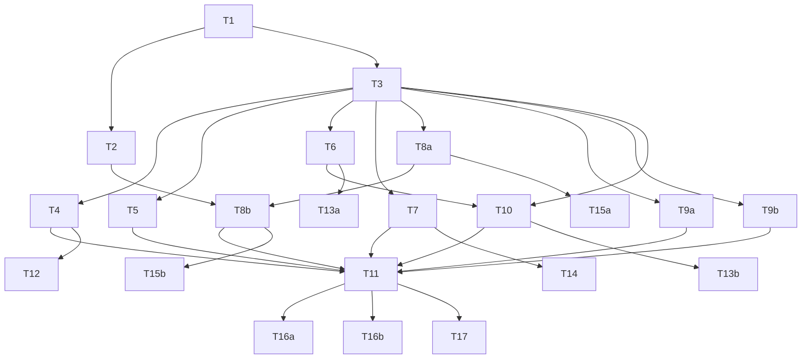

# Tasks

## Overview

22 tasks across 4 phases. Phase 1: project setup (T1 sequential, T2+T3 parallel). Phase 2: core components + engine orchestrator (all parallel). Phase 3: CLI integration + unit tests in parallel. Phase 4: E2E and CLI unit tests.

Critical path: T1 → T3 → T6 → T10 → T11 → T16a

---

## Dependency Map



---

## Phase 1 — Foundation

### Task T1: Project initialisation [x] 6cd0b3a

**Why:** Establishes the TypeScript project, installs all dependencies, and wires up the build and test pipeline. Nothing else can proceed without this.

**References:** Design: Component Boundaries, ADR-6 (commander), ADR-7 (vendor Mermaid)

**Inputs:** None

**Outputs:**
- `package.json` — name: `cdk-frosty`; bin: `{ "cdk-frosty": "./dist/cli.js" }`; scripts: `build` (tsc), `test` (jest)
- `tsconfig.json` — strict: true; target: ES2020; module: CommonJS; outDir: `dist/`; rootDir: `src/`; declaration: true
- `src/` directory structure (empty index stubs acceptable)
- `jest.config.js` — ts-jest preset, testMatch: `**/*.test.ts`

**Dependencies to install:**
- Runtime: `commander`
- Dev: `typescript`, `ts-node`, `jest`, `ts-jest`, `@types/node`, `@types/jest`

**Constraints:**
- TypeScript strict mode must be enabled
- CommonJS output (not ESM) — rules are loaded via `require()`
- No runtime dependencies other than `commander`

**Acceptance Criteria:**
- [ ] `npm run build` compiles without errors
- [ ] `npm test` runs Jest and exits 0
- [ ] `package.json` has `cdk-frosty` bin entry pointing to `dist/cli.js`
- [ ] After `npm run build`, `node dist/cli.js` exits non-zero — confirming the compiled entry point is wired correctly (even as a stub)
- [ ] `tsconfig.json` has strict: true, target: ES2020, module: CommonJS, outDir: dist

**Dependencies:** None

---

*T2 and T3 are independent and can run in parallel after T1.*

### Task T2: Vendor Mermaid [x] 34b1381

**Why:** ADR-7 requires Mermaid JS bundled inline in HTML output with no CDN dependency. The vendored file must be committed and available at build time.

**References:** Design: ADR-7, Component Boundaries (`vendor/mermaid.min.js`)

**Inputs:** T1

**Outputs:**
- `vendor/mermaid.min.js` — Mermaid minified JS, latest stable 10.x or 11.x
- `vendor/README.md` — records the exact Mermaid version vendored

**Approach:** `npm install --save-dev mermaid`, copy `node_modules/mermaid/dist/mermaid.min.js` to `vendor/mermaid.min.js`, record version in `vendor/README.md`, then `npm uninstall mermaid`.

**Constraints:**
- `vendor/mermaid.min.js` must be committed to git (not gitignored)
- Version must be recorded in `vendor/README.md`

**Acceptance Criteria:**
- [ ] `vendor/mermaid.min.js` exists and is >100KB
- [ ] `vendor/mermaid.min.js` is tracked by git
- [ ] `vendor/README.md` contains the exact version string (e.g. `11.4.0`)
- [ ] The version string in `vendor/README.md` matches the version in `vendor/mermaid.min.js`'s banner comment

**Dependencies:** T1

---

### Task T3: Shared type definitions [x] f246dca

**Why:** All other modules import from these three type files. They are the contracts between components — all Phase 2 tasks depend on them.

**References:** Design: Data Models (all three ERDs), Rule Module Contract

**Inputs:** T1

**Outputs:**
- `src/parser/types.ts`
- `src/engine/types.ts`
- `src/graph/types.ts`

**Type specifications:**

`src/parser/types.ts`:
```typescript
export interface CdkNode {
  id: string;           // last path segment; display fallback; unique among siblings only
  path: string;         // full CDK path; unique across tree; used as container ID
  fqn: string;          // constructInfo.fqn; defaults to 'unknown' if missing
  parentPath?: string;  // CDK path of parent; undefined on root
  children: CdkNode[];
  attributes: Record<string, unknown>;
}
export interface CdkTree { version: string; root: CdkNode; }
```

`src/graph/types.ts`:
```typescript
export interface ArchContainer {
  id: string; label: string; containerType: string; cdkPath: string;
  parentId?: string; groupId?: string; groupLabel?: string;
  metadata: Record<string, unknown>;
}
export interface ArchEdge {
  id: string; sourceId: string; targetId: string; label?: string;
  metadata: Record<string, unknown>;
}
export interface ArchGraph { containers: Map<string, ArchContainer>; edges: ArchEdge[]; roots: string[]; }
```

`src/engine/types.ts` (imports `ArchContainer` from `../graph/types`):
```typescript
export type RuleOutput =
  | { kind: 'container'; label: string; containerType: string }
  | { kind: 'edge'; sourceId: string; targetId: string; label?: string }
  | { kind: 'metadata'; targetEdgeSourceId: string; targetEdgeTargetId: string; key: string; value: unknown }
  | { kind: 'group'; groupLabel: string; memberFqn: string }
  | null;
export interface RuleContext { findContainer(pathOrFragment: string): ArchContainer | undefined; }
export interface Rule {
  id: string; priority: number;
  match(node: CdkNode): boolean;   // MUST be pure and stateless
  apply(node: CdkNode, context: RuleContext): RuleOutput;
}
export type RuleOutputMap = Map<string, { primary: RuleOutput; metadata: RuleOutput[]; sourceFqn: string }>;
```

**Constraints:**
- No implementation logic — interfaces and types only
- `RuleOutput` must be a discriminated union on `kind`
- Dependency direction: `engine/types` → `graph/types` → `parser/types` (no cycles)

**Acceptance Criteria:**
- [ ] All three files compile without errors
- [ ] `RuleOutput` is a proper discriminated union (TypeScript narrows correctly on `kind`)
- [ ] No circular imports (build succeeds with `--noCircularRefs` or tsc without circular errors)
- [ ] `RuleOutputMap` includes `sourceFqn` for group assignment lookup in `buildGraph`
- [ ] All field names and types match the design data model exactly

**Dependencies:** T1

---

## Phase 2 — Core

*All tasks in this phase are independent unless stated. T8b depends on T8a and T2. T10 depends on T6.*

---

### Task T4: Parser [x] 123499a

**Why:** First stage of the pipeline. Reads `tree.json` and produces a typed `CdkTree`.

**References:** Design: Component Boundaries (`parser/`), FR-2, FR-13

**Inputs:** T3 (`src/parser/types.ts`)

**Outputs:** `src/parser/index.ts` — `export function parse(filePath: string): CdkTree`

**Behaviour:**
- Read file; throw `{ exitCode: 1, message: 'File not found: <path>' }` if missing
- Parse JSON; throw `{ exitCode: 2, message: 'Invalid JSON: <path>' }` if invalid
- Validate: `parsed.tree` must exist and have `id` and `children`; throw `{ exitCode: 2, message: 'Input file is missing required field "<field>" (file: <path>)' }` if missing
- Detect CDK v1: warn to stderr if `tree.version` is absent or does not start with `tree-0.1` (best-effort; do not throw)
- Recursively build `CdkNode` tree; set `parentPath` on each child node
- If a node is missing `id` or `path`: skip it, emit `Warning: skipping malformed node: missing field "<field>"` to stderr
- If a node has no `constructInfo.fqn`: include it with `fqn: 'unknown'`; emit warning
- Strip ANSI escape sequences from file path in all error/warning messages

**Acceptance Criteria:**
- [ ] Fixture with 3-level nesting and multiple siblings at each level: all nodes returned; each non-root node has `parentPath` equal to its parent's `path`; root `parentPath` is `undefined`
- [ ] Non-existent file: throws object with `exitCode: 1`; message contains the file path
- [ ] Invalid JSON: throws with `exitCode: 2`
- [ ] Missing `tree.children`: throws with `exitCode: 2`; message names the missing field
- [ ] Node missing `constructInfo`: returned with `fqn: 'unknown'`; warning on stderr contains node path
- [ ] Node missing `id`: skipped; warning on stderr identifies the missing field and sibling context; all other nodes returned correctly

**Dependencies:** T3

---

### Task T5: Engine registry [x] bedc498

**Why:** The single extension point for rules (NFR-2). Validates and loads rule modules at startup.

**References:** Design: Component Boundaries (`engine/registry.ts`), ADR-1, ADR-5, FR-16

**Inputs:** T3 (`src/engine/types.ts`)

**Outputs:** `src/engine/registry.ts` — `export function loadRules(userRulesPaths: string[]): Rule[]`

**Behaviour:**
- Always load default rules from `../rules/default/index` first
- For each path in `userRulesPaths`:
  - Print to stderr: `Warning: loading rules from <path> (rules are executed as trusted code)`
  - Validate path is an existing regular file; throw `{ exitCode: 3, message: 'Rules file not found: <path>' }` if not
  - `require()` the file; validate export is a `Rule[]` array; for each element validate `id` (string), `priority` (number), `match` (function), `apply` (function); throw `{ exitCode: 3, message: 'Rule export in <path> is invalid: rule at index <N> is missing required field "<field>"' }` on failure
  - Append validated rules after defaults
- After all loaded: scan for ID collisions; for each collision emit `Warning: rule ID collision: "<id>" in <file> shadows an earlier rule with the same ID`; earlier rule wins; both retained in array
- Strip ANSI from paths in all output

**Acceptance Criteria:**
- [ ] No `--rules` flag: returns array of exactly 4 rules with IDs `['default/lambda', 'default/sqs', 'default/iam-role', 'default/event-source-mapping']` in that order
- [ ] Non-existent `--rules` path: throws `{ exitCode: 3 }`; message contains the path
- [ ] Export that is not an array: throws `{ exitCode: 3 }`
- [ ] Rule missing `apply` field: throws `{ exitCode: 3 }`; message contains index and field name
- [ ] ID collision: warning emitted; both rules present at their original positions; earlier rule is first
- [ ] Trust warning printed to stderr before each user rules file is loaded

**Dependencies:** T3

---

### Task T6: Engine evaluator [x] d3e9c14

**Why:** Per-node rule execution logic: two-pass filtering, priority ordering, match caching, demotion semantics.

**References:** Design: Component Boundaries (`engine/evaluator.ts`), ADR-2, ADR-5, FR-8, FR-14

**Inputs:** T3 (`src/engine/types.ts`)

**Outputs:** `src/engine/evaluator.ts`

```typescript
export function evaluateNode(
  node: CdkNode,
  rules: Rule[],
  pass: 1 | 2,
  matchCache: Map<string, boolean>,
  context: RuleContext
): { primary: RuleOutput; metadata: RuleOutput[] }
```

**Behaviour:**
- **Pass 1:** Call `rule.match(node)` for each rule; cache result as `matchCache.set('${rule.id}::${node.path}', result)`
- **Pass 2:** Read from cache — do not call `match()` again
- Filter to matching rules; sort by `priority` descending, then by original array index ascending (tie-break per ADR-5)
- If no matches: emit `Warning: no rule matched CDK node "<path>" (fqn: <fqn>)` to stderr; return `{ primary: null, metadata: [] }`
- Call `apply()` on the first matching rule, wrapped in try/catch; on throw: emit `Warning: rule "<id>" threw on node "<path>": <message>`; treat as `null`
- If primary result is `null`: return `{ primary: null, metadata: [] }` immediately — skip all remaining rules
- **Pass filter:** If primary `kind` doesn't match current pass (Pass 1 expects `container`/`group`; Pass 2 expects `edge`/`metadata`): treat as no primary for this pass; return `{ primary: null, metadata: [] }` for this pass (node will be re-evaluated in the correct pass)
- **Demotion:** For each remaining matching rule (after first): call `apply()` in try/catch. If result is `{ kind: 'metadata' }`: add to metadata array. If null: skip quietly. Any other kind: emit `Warning: rule "<id>" produced unexpected output type "<kind>" on node "<path>"; discarding`

**Acceptance Criteria:**
- [ ] Pass 1: `match()` called once per rule per node; results stored in cache
- [ ] Pass 2: cache keys used; `match()` not called again — verified by replacing `match()` with a counter function that returns alternating values; Pass 2 result equals Pass 1 cached value
- [ ] Higher-priority rule wins; equal-priority: earlier array index wins
- [ ] Null primary: lower-priority rules not evaluated (spy confirms zero calls)
- [ ] `apply()` throwing: one stderr warning with rule ID and node path; evaluation returns the next rule's output
- [ ] Lower-priority rule returning metadata output: included in metadata array
- [ ] Lower-priority rule returning non-metadata kind (e.g. `container`): exactly one warning on stderr; output not in result
- [ ] Fixture with three rules at priorities 10, 5, 5: primary is priority-10 rule; the two priority-5 rules are demoted; their outputs handled correctly

**Dependencies:** T3

---

### Task T7: Graph builder [x] a12275c

**Why:** Converts the flat `RuleOutputMap` into a structured `ArchGraph` with container hierarchy, group assignments, and resolved edges.

**References:** Design: Component Boundaries (`graph/`), ADR-3, FR-7, FR-10

**Inputs:** T3 (`src/graph/types.ts`, `src/engine/types.ts`)

**Outputs:** `src/graph/index.ts` — `export function buildGraph(outputMap: RuleOutputMap, tree: CdkTree): ArchGraph`

Note: `buildGraph` receives its inputs as parameters. It does not import from `parser/index.ts` or `engine/evaluator.ts`.

**Behaviour:**
- **Containers:** For each `outputMap` entry where `primary.kind === 'container'`: create `ArchContainer` with `id = cdkPath = entry.path`. Attach metadata outputs from `entry.metadata` to `container.metadata`.
- **Hierarchy:** For each container, determine `parentId`: walk CDK path upward by progressively removing trailing `/segment` until a path that exists in the container map is found. That is the `parentId`. If none found: container is a root. Paths are normalised (no trailing slashes).
- **Groups:** Collect all `{ kind: 'group' }` outputs from outputMap, associated with the rule's priority (stored in `RuleOutputMap` via `sourceFqn`). For each container, find the group output whose `memberFqn === container's source fqn`. If multiple match, highest-priority group wins. Set `groupId` and `groupLabel`.
- **Edges:** For each `primary.kind === 'edge'`: create `ArchEdge` with `id = "${sourceId}--${targetId}"`. If that ID already exists: append `--2`, `--3`, etc. Attach metadata.
- **Missing edge targets:** If any metadata output's `(targetEdgeSourceId, targetEdgeTargetId)` pair matches no edge: emit `Warning: rule produced metadata targeting edge <src> --> <tgt>, but that edge does not exist`
- **roots:** Container IDs with no `parentId`

**Acceptance Criteria:**
- [ ] Flat containers: all are roots; no `parentId` set
- [ ] `Stack/Lambda`: Lambda's `parentId === 'Stack'`
- [ ] `Stack/L3/Lambda` where L3 has no container: Lambda's `parentId === 'Stack'` (skip-level)
- [ ] Three-level nesting `A/B/C`: C's `parentId === 'B'`, not `'A'`
- [ ] Group assignment: container with matching `sourceFqn` gets correct `groupId` and `groupLabel`
- [ ] Two group rules match same container: higher-priority group's `groupLabel` is used
- [ ] First edge between pair: `id === "${srcId}--${tgtId}"`; second: `id === "${srcId}--${tgtId}--2"`; third: `--3`
- [ ] Metadata on valid edge: attached to `edge.metadata[key]`
- [ ] Metadata targeting non-existent edge: stderr warning emitted; metadata dropped

**Dependencies:** T3

---

### Task T8a: Mermaid syntax generator [x] bbc4ed2

**Why:** Converts `ArchGraph` into valid Mermaid `flowchart TD` syntax. CDK hierarchy → subgraphs. Groups → label annotations. Mermaid-safe escaping for all user data.

**References:** Design: Component Boundaries (`renderer/mermaid.ts`), ADR-4, FR-9, FR-17

**Inputs:** T3 (`src/graph/types.ts`)

**Outputs:** `src/renderer/mermaid.ts` — `export function archGraphToMermaid(graph: ArchGraph): string`

**Behaviour:**
- **Node ID sanitisation:** Replace all non-alphanumeric characters in CDK paths with `_` for use as Mermaid node IDs (e.g. `MyStack/MyFunction` → `MyStack_MyFunction`)
- **Label escaping (Mermaid-safe):** In label strings, replace: `"` → `#quot;`, `[` → `#lsqb;`, `]` → `#rsqb;`, `(` → `#lpar;`, `)` → `#rpar;`, `<` → `#lt;`, `>` → `#gt;`. Strip newlines. Wrap label in `["..."]`.
- **Group annotation:** If `container.groupLabel` is set, prefix label: `[GroupLabel] ContainerLabel`
- **Containers with children** (other containers have `parentId === container.id`): emit as `subgraph <nodeId> ["<label>"] ... end`
- **Leaf containers** (no children): emit as `<nodeId>["<label>"]`
- **Nesting:** Build subgraph tree recursively from `graph.roots`
- **Edges:** After all nodes/subgraphs: `<srcId> -->|"<label>"| <tgtId>` (omit `|...|` if no label)
- Output: `flowchart TD\n<nodes and subgraphs>\n<edges>`

**Acceptance Criteria:**
- [ ] Single leaf container → `flowchart TD\n  id["Label"]`
- [ ] Container with one child → subgraph block containing the child node
- [ ] Group label → label prefixed with `[GroupName] `
- [ ] Edge with label → `src -->|"label"| tgt`; edge without label → `src --> tgt`
- [ ] CDK path `/` sanitised to `_` in node IDs
- [ ] Label `<script>alert(1)</script>` → Mermaid-escaped form (e.g. `#lt;script#gt;...`) appears in output; output passes `mermaid.parse()` using the vendored Mermaid JS without error
- [ ] Edges appear after all `subgraph`/node definitions
- [ ] Label containing `"` and `[` → escaped to `#quot;` and `#lsqb;` respectively

**Dependencies:** T3

---

### Task T8b: HTML template and renderer [x] 317997a

**Why:** Wraps Mermaid syntax in a self-contained HTML file. Inlines vendored Mermaid JS. HTML-escapes all user-derived values.

**References:** Design: Component Boundaries (`renderer/`), ADR-7, FR-9, FR-17

**Inputs:** T2 (`vendor/mermaid.min.js`), T3, T8a

**Outputs:**
- `src/renderer/template.ts` — `export function wrapInHtml(mermaidSyntax: string): string`
- `src/renderer/index.ts` — `export function render(graph: ArchGraph): string`

**`wrapInHtml` behaviour:**
- Read `vendor/mermaid.min.js` (resolve path relative to `__dirname`)
- HTML-escape `mermaidSyntax` for embedding in `<pre>`: replace `&` → `&amp;`, `<` → `&lt;`, `>` → `&gt;`, `"` → `&quot;`
- Template: `<!DOCTYPE html><html>...<pre class="mermaid">ESCAPED</pre><script>VENDORED_JS</script><script>mermaid.initialize({startOnLoad:true,theme:'default'});</script>...`
- Vendored JS embedded verbatim inside `<script>` (not HTML-escaped — it is trusted source)

**`render`:** `render(graph) → wrapInHtml(archGraphToMermaid(graph))`

**Acceptance Criteria:**
- [ ] Output HTML contains `<pre class="mermaid">` with HTML-escaped Mermaid syntax
- [ ] Output HTML contains inlined `<script>` with Mermaid JS (size matches `vendor/mermaid.min.js`)
- [ ] HTML contains no `<script src=`, no `<link href=`, no `https?://` URLs anywhere in the output
- [ ] Mermaid syntax containing `</pre>` HTML-escaped so it does not break the `<pre>` tag
- [ ] Extracting text content of `<pre class="mermaid">`, unescaping HTML entities, then passing to `mermaid.parse()` from vendored JS → no parse error
- [ ] `render()` correctly chains `archGraphToMermaid` → `wrapInHtml`

**Dependencies:** T2, T3, T8a

---

### Task T9a: Default rules — Lambda, SQS, IAM Role [x] 5ca74ad

**Why:** Three of the four default rules required by FR-15. Lambda and SQS produce containers; IAM Role suppresses the "unmatched node" warning via null return.

**References:** Design: Component Boundaries (`rules/default/`), FR-15

**Inputs:** T3 (`src/engine/types.ts`)

**Outputs:**
- `src/rules/default/lambda.ts`
- `src/rules/default/sqs.ts`
- `src/rules/default/iam-role.ts`
- `src/rules/default/index.ts` — barrel (imports all four rules; updated by T9b)

**Specifications:**

`lambda.ts`: `id: 'default/lambda'`, `priority: 50`. `match`: `node.fqn === 'aws-cdk-lib.aws_lambda.Function'`. `apply`: `{ kind: 'container', label: node.id, containerType: 'lambda' }`.

`sqs.ts`: `id: 'default/sqs'`, `priority: 50`. `match`: `node.fqn === 'aws-cdk-lib.aws_sqs.Queue'`. `apply`: `{ kind: 'container', label: node.id, containerType: 'queue' }`.

`iam-role.ts`: `id: 'default/iam-role'`, `priority: 20`. `match`: `node.fqn === 'aws-cdk-lib.aws_iam.Role'`. `apply`: returns `null` (suppresses unmatched warning; demoted to metadata producer when co-present with EventSourceMapping).

`index.ts`: `export const defaultRules: Rule[] = [lambdaRule, sqsRule, iamRoleRule]` — EventSourceMapping will be added in T9b.

**Acceptance Criteria:**
- [ ] Lambda rule: `match()` returns true for `aws-cdk-lib.aws_lambda.Function`; false for `aws-cdk-lib.aws_lambda.DockerImageFunction` (same package prefix, different class); false for unrelated FQN
- [ ] SQS rule: `match()` returns true for `aws-cdk-lib.aws_sqs.Queue`; false for `aws-cdk-lib.aws_sqs.QueuePolicy`; false for unrelated FQN
- [ ] IAM role rule: `match()` returns true for `aws-cdk-lib.aws_iam.Role`; `apply()` returns `null`
- [ ] All three compile without TypeScript errors

**Dependencies:** T3

---

### Task T9b: Default rules — EventSourceMapping [x] e39e54d

**Why:** The most complex default rule. Requires edge resolution logic and a queue-finding heuristic. Kept separate from T9a due to its non-trivial implementation.

**References:** Design: Component Boundaries (`rules/default/event-source-mapping.ts`), ADR-2, ADR-3

**Inputs:** T3 (`src/engine/types.ts`); T9a (`src/rules/default/index.ts` to update)

**Outputs:**
- `src/rules/default/event-source-mapping.ts`
- Update `src/rules/default/index.ts` to add `eventSourceMappingRule` to the exported array

**Specification:**

`id: 'default/event-source-mapping'`, `priority: 70`.
`match`: `node.attributes?.['aws:cdk:cloudformation:type'] === 'AWS::Lambda::EventSourceMapping'`.
`apply(node, context)`:
1. Derive `lambdaPath = node.path.split('/').slice(0, -1).join('/')` (parent is the Lambda)
2. `const lambda = context.findContainer(lambdaPath)`
3. Find the SQS queue: look up `context.findContainer` with the stack prefix — the rule iterates known suffixes to find a Queue container. Heuristic: find the first container in the same stack (same first path segment) whose `containerType === 'queue'`. Since `RuleContext` only exposes `findContainer(pathOrFragment)`, the rule must use known path fragments. For v1, try `context.findContainer(stackPath + '/Queue')` where stackPath is `node.path.split('/')[0]` — if not found, return `null`.
4. If both resolved: `{ kind: 'edge', sourceId: queue.id, targetId: lambda.id, label: 'triggers' }`; else `null`

Update `index.ts` to: `export const defaultRules: Rule[] = [lambdaRule, sqsRule, iamRoleRule, eventSourceMappingRule]`

**Acceptance Criteria:**
- [ ] `match()` returns true only for `aws:cdk:cloudformation:type === 'AWS::Lambda::EventSourceMapping'`; false for other CFn types
- [ ] `match()` returns false for nodes with no attributes or no CFn type attribute
- [ ] `apply()` with both Lambda and SQS containers resolvable via `context.findContainer`: returns edge with `sourceId = queue.id`, `targetId = lambda.id`, `label: 'triggers'`
- [ ] `apply()` when Lambda not resolvable: returns `null`
- [ ] `apply()` when SQS queue not resolvable: returns `null`
- [ ] `index.ts` exports all four rules in order: `[lambdaRule, sqsRule, iamRoleRule, eventSourceMappingRule]`
- [ ] `loadRules([])` (no user rules) returns array with all four default rules

**Dependencies:** T3, T9a

---

### Task T10: Engine orchestrator [x] 5837edc

**Why:** Coordinates two-pass evaluation across all CDK nodes. Integrates the evaluator with the `RuleContext` (container lookup by path).

**References:** Design: Component Boundaries (`engine/index.ts`), ADR-2, ADR-3

**Inputs:** T3 (types), T6 (`engine/evaluator.ts`)

Note: `engine/index.ts` does not import from `engine/registry.ts`. The CLI passes the pre-loaded `Rule[]` in.

**Outputs:** `src/engine/index.ts` — `export function transform(tree: CdkTree, rules: Rule[]): RuleOutputMap`

**Behaviour:**
- Flatten `CdkTree` to `CdkNode[]` (depth-first)
- Create `matchCache: Map<string, boolean>`
- **Pass 1:** Create a Pass-1 `RuleContext` where `findContainer()` always returns `undefined`. For each node, call `evaluateNode(node, rules, 1, matchCache, pass1Context)`. Collect all container/group primary outputs into `containerMap: Map<string, ArchContainer>` (partial — just enough for lookup: `{ id: node.path }`)
- **Pass 2:** Build real `RuleContext`: `findContainer(pathOrFragment)` — first try `containerMap.get(pathOrFragment)` (exact); if not found, scan all keys for suffix match (`key === pathOrFragment || key.endsWith('/' + pathOrFragment)`); if multiple suffix matches: emit `Warning: findContainer('<fragment>') matched multiple containers: <paths>; using shallowest` and return the match with the shortest path. For each node, call `evaluateNode(node, rules, 2, matchCache, pass2Context)`
- Store all outputs in `RuleOutputMap` (include `sourceFqn` from node.fqn)
- Return `RuleOutputMap`

**Acceptance Criteria:**
- [ ] All nodes in a 10-node tree appear in the returned map
- [ ] `match()` called once per rule per node total across both passes (cache verified via spy)
- [ ] Pass-1 `context.findContainer()` always returns `undefined` — verified by a rule that calls `context.findContainer` in Pass 1 and asserts undefined
- [ ] Pass-2 exact match: `findContainer('MyStack/MyFunction')` returns the container with that path
- [ ] Pass-2 suffix match: `findContainer('MyFunction')` with one candidate returns that container; no warning
- [ ] Pass-2 ambiguous suffix: two containers ending in `MyBucket`; `findContainer('MyBucket')` emits warning; returns the shorter path

**Dependencies:** T3, T6

---

## Phase 3 — Integration and Unit Tests

*T11 (CLI) and T12–T15 (unit tests) can run in parallel. T11 is needed before Phase 4.*

---

### Task T11: CLI [x] a96f325

**Why:** User-facing entry point. Wires all pipeline stages together, handles argument parsing, error formatting, and exit codes.

**References:** Design: CLI Interface (full section), ADR-6, FR-1, FR-11, FR-12

**Inputs:** T4, T5, T7, T8b, T9a, T9b, T10

**Outputs:** `src/cli.ts`

**Behaviour:**
- `commander` program with `<input>` positional, `--output <path>`, `--rules <path>` (`.option()` called as `.option('--rules <path>', ...).on('option:rules', ...)` or collected as an array — multiple invocations must all be collected)
- No args → commander prints help; exit 1
- Compute default output path: `path.join(path.dirname(inputPath), path.basename(inputPath, path.extname(inputPath)) + '.html')`
- Pipeline: `parse(input)` → `loadRules(rulesPaths)` → `transform(tree, rules)` → `buildGraph(outputMap, tree)` → `render(graph)` → `fs.writeFileSync(outputPath, html)`
- Catch typed errors with `exitCode` property: print `Error [N]: <message>` to stderr; `process.exit(N)`
- Top-level catch-all: print `Error [4]: <message>` to stderr; exit 4
- On success: print `Architecture diagram written to: <absolutePath>` to stdout
- **ANSI stripping:** Apply to all user-derived values before printing to stderr (strip `\x1b[...m` sequences)

**Implementation note for tests:** T11 is implementation only. CLI unit tests are in T17; E2E tests in T16a.

**Acceptance Criteria:**
- [ ] No args: commander help printed; exit code 1
- [ ] Valid `tree.json`: full pipeline runs; HTML file written; stdout confirmation printed
- [ ] Output path defaults to `<input-dir>/<input-basename>.html`
- [ ] `--output` overrides output path
- [ ] `--rules` specified twice: both paths collected and passed to `loadRules`
- [ ] File not found error: exit 1; correct message on stderr
- [ ] Invalid JSON error: exit 2
- [ ] Rules load error: exit 3
- [ ] ANSI sequences in a file path are stripped from stderr output

**Dependencies:** T4, T5, T7, T8b, T9a, T9b, T10

---

### Task T12: Parser unit tests [x] b2e9984

**Why:** Validates all parser behaviour in isolation.

**References:** Design: Test Scenarios 6, 7; FR-2, FR-13

**Inputs:** T4

**Outputs:** `src/parser/index.test.ts`

**Test cases:**
1. Valid tree with 3-level nesting: exact node count returned; each non-root node has correct `parentPath`; root has `parentPath: undefined`
2. Multiple siblings at same level: all included with same `parentPath`
3. File not found: throws with `exitCode: 1`; message contains path
4. Valid JSON but not an object: throws with `exitCode: 2`
5. Missing `tree` field: throws `exitCode: 2`; message names `tree`
6. Missing `tree.children`: throws `exitCode: 2`; message names `tree.children`
7. Node missing `constructInfo`: included with `fqn: 'unknown'`; warning on stderr contains node's `path`
8. Node missing `id`: skipped; warning on stderr names missing field; remaining nodes returned

**Acceptance Criteria:**
- [ ] All 8 test cases pass
- [ ] `npm test` exits 0

**Dependencies:** T4

---

### Task T13a: Evaluator unit tests [x] b991ac9

**Why:** Validates per-node rule evaluation in isolation: match caching, priority, demotion, null suppression, exceptions.

**References:** Design: Rule evaluation flowchart, ADR-2, ADR-5

**Inputs:** T6

**Outputs:** `src/engine/evaluator.test.ts`

**Test cases:**
1. Single matching rule in Pass 1: primary output collected
2. Higher-priority rule wins; lower becomes metadata output
3. Equal-priority rules: earlier array index wins — verified with two rules at same priority
4. Declaration-order tie-breaking: three rules at same priority; array position determines winner
5. `match()` caching: rule with counter — Pass 1 calls it; Pass 2 uses cached value regardless of what a fresh call would return
6. Null primary: `apply()` returns null; all lower-priority rules skipped (spy confirms zero calls)
7. `apply()` throwing: warning on stderr with rule ID and node path; next matching rule's output returned
8. Lower-priority rule returning metadata: included in metadata array
9. Lower-priority rule returning non-metadata kind: exactly one warning; output absent from result
10. No matching rules: warning on stderr with path and fqn; `{ primary: null, metadata: [] }` returned

**Acceptance Criteria:**
- [ ] All 10 test cases pass
- [ ] `npm test` exits 0

**Dependencies:** T6

---

### Task T13b: Engine orchestrator unit tests [x] f2d94c5

**Why:** Validates two-pass coordination, `findContainer` resolution, and `RuleOutputMap` construction.

**References:** Design: ADR-2, ADR-3, Test Scenarios 11, 12

**Inputs:** T10

**Outputs:** `src/engine/index.test.ts`

**Test cases:**
1. 5-node tree: all nodes appear in `RuleOutputMap` after `transform()`
2. Pass 1 context: `findContainer` returns `undefined` for any call — verified by a rule that calls `context.findContainer` in `apply()` and records the result
3. Pass 2 exact match: `findContainer('MyStack/MyFunction')` returns the correct container
4. Pass 2 suffix match (one candidate): `findContainer('MyFunction')` returns container; no warning
5. Pass 2 ambiguous suffix (two candidates): warning on stderr; shallowest path returned
6. match() called once per rule per node total across both passes (cache confirmed with spy counter)
7. Two-pass ordering: container produced in Pass 1 is accessible in Pass 2 via `findContainer`; edge rule successfully resolves to it

**Acceptance Criteria:**
- [ ] All 7 test cases pass
- [ ] `npm test` exits 0

**Dependencies:** T10

---

### Task T14: Graph builder unit tests [x] 9e56a05

**Why:** Validates containment hierarchy, group assignment, edge IDs, and metadata attachment.

**References:** Design: ADR-3, ADR-4, Test Scenario 3

**Inputs:** T7

**Outputs:** `src/graph/index.test.ts`

**Test cases:**
1. All containers at top level (no nesting): all are roots; no `parentId`
2. `Stack/Lambda`: Lambda's `parentId === 'Stack'`
3. `Stack/L3/Lambda` with L3 having no container: Lambda's `parentId === 'Stack'` (skip-level)
4. Three levels `A/B/C`: C's `parentId === 'B'`; B's `parentId === 'A'` (nearest ancestor, not grandparent)
5. Group assignment: container with matching `sourceFqn` gets `groupId` and `groupLabel`
6. Two groups match same container: higher-priority group's labels used
7. First edge `src--tgt`: `id === 'src--tgt'`; second same pair: `id === 'src--tgt--2'`; third: `'src--tgt--3'`
8. Metadata on valid edge: `edge.metadata[key] === value`
9. Metadata targeting non-existent edge: warning on stderr; metadata dropped

**Acceptance Criteria:**
- [ ] All 9 test cases pass
- [ ] `npm test` exits 0

**Dependencies:** T7

---

### Task T15a: Mermaid syntax unit tests [x] 11fd3e1

**Why:** Validates Mermaid flowchart generation, subgraphs, group annotations, escaping, and output parseability.

**References:** Design: ADR-4, Test Scenario 9

**Inputs:** T8a

**Outputs:** `src/renderer/mermaid.test.ts`

**Test cases:**
1. Single leaf container: output is `flowchart TD\n  id["Label"]`
2. Parent with two children: emits subgraph block containing both child nodes
3. Group label: container with `groupLabel: 'Compute'` → label is `[Compute] ContainerName`
4. Edge with label: `src -->|"triggers"| tgt`; edge without label: `src --> tgt`
5. CDK path `MyStack/MyFunction` → node ID `MyStack_MyFunction`
6. Label containing `<script>alert(1)</script>`: output contains `#lt;script#gt;`; passes `mermaid.parse()` via vendored JS
7. Label containing `"` → `#quot;`; `[` → `#lsqb;`
8. Edges appear after all subgraph/node definitions in the output string
9. Synthetic group renders as label annotation, not as a `subgraph` block

**Acceptance Criteria:**
- [ ] All 9 test cases pass
- [ ] `npm test` exits 0

**Dependencies:** T8a

---

### Task T15b: HTML template unit tests [x] 1df82a4

**Why:** Validates HTML wrapper, Mermaid JS inlining, HTML escaping, and round-trip correctness.

**References:** Design: ADR-7, FR-17

**Inputs:** T8b

**Outputs:** `src/renderer/template.test.ts`

**Test cases:**
1. Output contains `<pre class="mermaid">` with HTML-escaped Mermaid syntax
2. Output contains `<script>` tag with content matching `vendor/mermaid.min.js` (by byte length)
3. Output contains no `<script src=`, no `<link href=`, no `https?://` URLs anywhere
4. Mermaid syntax containing `</pre>`: HTML-escaped in output so pre tag is not broken
5. Round-trip: extract `<pre>` text content, unescape HTML entities, pass to `mermaid.parse()` → no error
6. `render()` with a minimal graph: output is non-empty HTML string containing `<pre class="mermaid">`

**Acceptance Criteria:**
- [ ] All 6 test cases pass
- [ ] `npm test` exits 0

**Dependencies:** T8b

---

## Phase 4 — End-to-End Verification

---

### Task T16a: Functional E2E tests [x] 5eb85e3

**Why:** Validates the full pipeline from CLI invocation to HTML output for all functional scenarios.

**References:** Design: Test Scenarios 1, 3, 4, 5, 8, 10, 14

**Inputs:** T11

**Outputs:** `test/e2e/functional.test.ts` + fixture files in `test/e2e/fixtures/`

**Test scenarios:**

*Scenario 1 (basic pipeline):* Fixture `fixtures/basic.json`: Stack with Lambda (`aws-cdk-lib.aws_lambda.Function`), SQS Queue (`aws-cdk-lib.aws_sqs.Queue`), and EventSourceMapping child of Lambda. Run `dist/cli.js fixtures/basic.json`. Assert HTML contains Lambda node ID, SQS node ID, and an edge between them. Assert stdout matches `Architecture diagram written to:`.

*Scenario 3 (synthetic group):* Fixture with two Lambdas. User rule (created inline as a temp `.js` file) adds a `Compute` group for Lambda FQN. Assert both Lambda node labels in HTML contain `[Compute]`.

*Scenario 4 (unmatched node warning):* Fixture with a `aws-cdk-lib.aws_dynamodb.CfnTable` node. Run with default rules. Assert stderr contains `no rule matched CDK node`; HTML file is written.

*Scenario 5 (user rule override):* User rule file (priority 200) maps Lambdas to `containerType: 'function'` with label `'Function'`. Assert HTML contains node labeled `Function`; assert stderr contains `loading rules from`.

*Scenario 8 (output path defaulting):* Write fixture to a temp directory. Run with no `--output`. Assert HTML written to `<tempDir>/fixture.html`.

*Scenario 10 (missing rules file):* `--rules /nonexistent/rules.js`. Assert exit code 3; no HTML file written; stderr contains `Rules file not found`.

*Scenario 14 (no args):* Run `dist/cli.js` with no args. Assert exit code 1; stdout or stderr contains usage text.

**Acceptance Criteria:**
- [ ] All 7 functional E2E scenarios pass
- [ ] Scenario 1 HTML passes `mermaid.parse()` from vendored JS
- [ ] `npm test` exits 0

**Dependencies:** T11

---

### Task T16b: Performance E2E test [x] b8e2077

**Why:** Validates NFR-1 — 500-node tree completes in under 5 seconds.

**References:** Design: Test Scenario 13, NFR-1

**Inputs:** T11

**Outputs:** `test/e2e/performance.test.ts`

**Approach:**
- Programmatically generate a synthetic `tree.json` with 500 nodes (e.g. 1 App → 1 Stack → 50 Lambdas, each with an ExecutionRole child + EventSourceMapping child + 1 SQS queue per Lambda)
- Write to a temp file
- Measure wall-clock time of `child_process.execFileSync('node', ['dist/cli.js', tempFile])` with a timeout of 10 seconds
- Assert elapsed < 5000ms AND elapsed > 50ms (lower bound confirms the process was not short-circuited)

**Acceptance Criteria:**
- [ ] 500-node synthetic tree processed and HTML written
- [ ] Wall-clock time: 50ms < elapsed < 5000ms
- [ ] `npm test` exits 0

**Dependencies:** T11

---

### Task T17: CLI unit tests [x] d28f7bb

**Why:** Tests CLI error path logic (exit codes, output formatting, ANSI stripping) without requiring a full build or E2E environment.

**References:** Design: CLI Interface (exit codes 0-4), ADR-6

**Inputs:** T11

**Outputs:** `src/cli.test.ts`

**Approach:** Mock `parse`, `loadRules`, `transform`, `buildGraph`, `render`, `fs.writeFileSync` using Jest module mocks. Test the CLI's error-handling and output logic in isolation.

**Test cases:**
1. `parse()` throws `{ exitCode: 1 }`: `process.exit` called with 1; stderr contains `Error [1]`
2. `parse()` throws `{ exitCode: 2 }`: exit 2; stderr contains `Error [2]`
3. `loadRules()` throws `{ exitCode: 3 }`: exit 3; stderr contains `Error [3]`
4. Unhandled exception: exit 4; stderr contains `Error [4]`
5. `fs.writeFileSync` throws: exit 4
6. All mocks succeed: `process.exit` not called; stdout contains `Architecture diagram written to:`
7. Output path defaulting: input `/a/b/tree.json`, no `--output` → output path is `/a/b/tree.html`
8. `--rules` flag twice: both paths passed to `loadRules`
9. ANSI sequence `\x1b[31m/bad/path\x1b[0m` in error message: stripped in stderr output

**Acceptance Criteria:**
- [ ] All 9 test cases pass
- [ ] Exit codes tested individually (not just "non-zero")
- [ ] `npm test` exits 0

**Dependencies:** T11

---

## Coverage Validation

| Component | Task |
|---|---|
| `src/parser/` | T4, T12 |
| `src/engine/types.ts` | T3, T13a |
| `src/engine/registry.ts` | T5, T13b |
| `src/engine/evaluator.ts` | T6, T13a |
| `src/engine/index.ts` | T10, T13b |
| `src/graph/` | T7, T14 |
| `src/renderer/mermaid.ts` | T8a, T15a |
| `src/renderer/template.ts` + `index.ts` | T8b, T15b |
| `src/rules/default/` (lambda, sqs, iam-role) | T9a |
| `src/rules/default/event-source-mapping.ts` | T9b |
| `src/cli.ts` | T11, T17 |
| `vendor/mermaid.min.js` | T2, T15b |
| Scenario 1 | T16a |
| Scenario 2 | T13a |
| Scenario 3 | T14, T16a |
| Scenario 4 | T16a |
| Scenario 5 | T16a |
| Scenario 6 | T12 |
| Scenario 7 | T12 |
| Scenario 8 | T16a, T17 |
| Scenario 9 | T15a |
| Scenario 10 | T16a |
| Scenario 11 | T13b |
| Scenario 12 | T7, T14 |
| Scenario 13 | T16b |
| Scenario 14 | T16a |

---

## Feedback Log

**Dependency — T10 over-declares T5** — **Applied** — T10 only needs evaluateNode (T6) and types (T3). T5 removed from T10 deps; T5→T10 edge removed from map.

**Dependency — T10 missing explicit T3** — **Applied** — Added T3→T10 to dependency map.

**Dependency — T5 missing from T11** — **Applied** — T11 imports loadRules from T5. Added T5→T11 to map and T11 task deps.

**Dependency — Mermaid diagram missing edges** — **Ignored** — T8b→T11, T9→T11, T10→T11 were already present. T5→T11 was genuinely missing and has been added.

**Dependency — T5→T10 edge contradicts task prose** — **Applied** — Removed T5→T10 (consistent with T5 dependency removal above).

**Dependency — T13 may need T6 or T9** — **Ignored** — T13 split into T13a (→T6) and T13b (→T10). Test fixtures use synthetic rule objects; T9 is not a test dependency.

**Dependency — T7 annotation about parameters** — **Applied** — Added explicit note to T7 that buildGraph receives inputs as parameters and does not import from T4 or T6.

**Granularity — T3 split into three** — **Ignored** — Types are small and tightly coupled. The cross-module dependency (engine→graph) is a known design decision. Splitting adds coordination overhead without benefit.

**Granularity — T9 split** — **Applied** — T9 split into T9a (lambda/sqs/iam-role/index stub) and T9b (event-source-mapping + index update). EventSourceMapping rule is complex enough to warrant its own task.

**Granularity — T13 split** — **Applied** — T13 split into T13a (evaluator tests) and T13b (engine/index tests). Two distinct source files with different concerns.

**Granularity — T15 split** — **Applied** — T15 split into T15a (mermaid.ts tests) and T15b (template.ts tests).

**Granularity — T16 split** — **Applied** — T16 split into T16a (functional) and T16b (performance). Performance test requires distinct infrastructure.

**Granularity — T11 ambiguous scope** — **Applied** — T11 explicitly noted as implementation only; tests in T17 and T16a.

**Granularity — T2 too small, merge with T8b** — **Ignored** — T2 is a distinct, committable step that creates a tracked artifact. Merging with T8b would obscure the vendor step and make the dependency harder to reason about.

**Coverage — Missing CLI unit tests** — **Applied** — Added T17 covering exit code matrix, output path defaulting, ANSI stripping, and multiple --rules handling.

**Coverage — Priority tie-breaking unit test** — **Applied** — Added test case 4 to T13a (declaration-order tie-breaking).

**Coverage — Output path defaulting unit test** — **Applied** — Added to T17 (test case 7) and noted in T11.

**Coverage — Rule validation load testing** — **Applied** — T5 acceptance criteria cover this; T13b includes registry load verification.

**Coverage — Two-pass ordering guarantee** — **Applied** — Added test case 7 to T13b.

**Coverage — findContainer exact vs suffix** — **Applied** — T13b test cases 3 and 4 explicitly test each branch.

**Coverage — Group label annotation in renderer** — **Applied** — Added test case 9 to T15a.

**Coverage — ADR-7 inline assertion** — **Applied** — T15b test case 2 verifies JS inlining by byte length comparison.

**Coverage — Performance fixture task** — **Ignored** — T16b includes fixture generation inline. A separate task would be over-engineering.

**Coverage — Default rules index explicit deliverable** — **Applied** — T9a and T9b each have explicit acceptance criteria for the index.

**Sequencing — T2 and T3 can be parallel** — **Applied** — Both moved to parallel step in Phase 1 description. No dependency between them.

**Sequencing — T8a/T8b sub-sequencing within Phase 2** — **Applied** — Phase 2 notes that T8b depends on T8a; dependency map reflects this.

**Sequencing — T10 can move to Phase 2** — **Applied** — T10 only needs T3 and T6; moved to Phase 2.

**Sequencing — T12, T14, T15 to Phase 3** — **Applied** — Moved to Phase 3 (parallel with T11). Allows early defect detection.

**Sequencing — T13 to Phase 3** — **Applied** — With T10 in Phase 2, T13a (→T6) and T13b (→T10) both move to Phase 3.

**Verification — T1 bin wiring** — **Applied** — Added criterion: after build, `node dist/cli.js` exits non-zero.

**Verification — T2 version documentation** — **Applied** — Added criterion that version in README matches banner in JS file.

**Verification — T3 fields match design** — **Ignored** — Type snapshot tests (tsd/ts-morph) are over-engineering. The build compilation + code review is sufficient for type structure verification.

**Verification — T4 fixture specificity** — **Applied** — Acceptance criteria now require 3-level nesting with siblings and exact parentPath assertions.

**Verification — T4 warning content** — **Applied** — Warning must contain node path and missing field name.

**Verification — T5 default rules order** — **Applied** — Acceptance criteria now assert exact IDs and order.

**Verification — T5 ID collision behavior** — **Applied** — Clarified: both rules retained; earlier is first; warning identifies the later rule.

**Verification — T6 cache verification** — **Applied** — Test case 5 uses counter-based match function to verify caching.

**Verification — T6 apply() throwing continues** — **Applied** — Test case 7 verifies next rule's output is returned after throw.

**Verification — T6 demotion specifics** — **Applied** — Test case 8/9 use a fixture with specific priorities to verify exact behavior.

**Verification — T7 deep nesting** — **Applied** — Test case 4 uses three levels to verify nearest-ancestor logic.

**Verification — T7 edge ID suffix pattern** — **Applied** — Test case 7 asserts `--2`, `--3` suffix pattern explicitly.

**Verification — T8a Mermaid parseable** — **Applied** — Test case 6 uses `mermaid.parse()` from vendored JS.

**Verification — T8a escaping specific characters** — **Applied** — Test cases 6 and 7 assert specific escape sequences.

**Verification — T8b round-trip escaping** — **Applied** — Test case 5 extracts, unescapes, and parses.

**Verification — T8b external URL check broader** — **Applied** — Test case 3 checks for any `https?://` URL in the entire output.

**Verification — T9 negative match cases** — **Applied** — All three rules in T9a now have negative fixture assertions.

**Verification — T9 EventSourceMapping edge vs null** — **Applied** — T9b acceptance criteria include both resolvable and unresolvable fixture cases.

**Verification — T10 suffix match precision** — **Applied** — T13b test cases 3/4/5 specify exact suffix-matching behavior.

**Verification — T11 HTML content check** — **Applied** — T11 acceptance criteria check the HTML contains the pipeline output.

**Verification — T11 exit code matrix** — **Applied** — T17 test cases enumerate one scenario per exit code (1,2,3,4).

**Verification — T12-T15 test case enumeration** — **Ignored** — Test case numbers and descriptions are specified within each task. Requiring a separate enumerated acceptance criterion per test case would be over-prescriptive.

**Verification — T16b performance lower bound** — **Applied** — T16b asserts elapsed > 50ms.

**Verification — T16a scenario enumeration** — **Applied** — T16a task explicitly names all 7 scenarios being tested.
