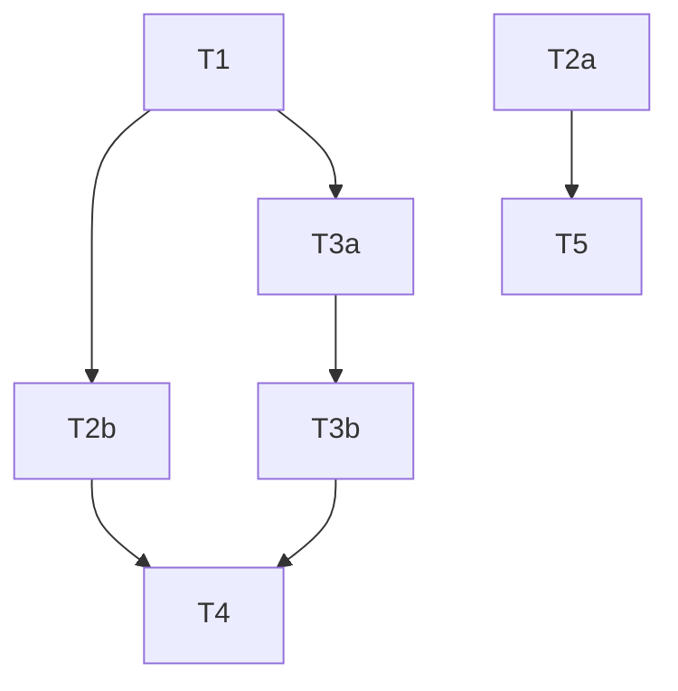

# Tasks — renderer-plugin

## Overview

6 tasks across 4 phases. Adds a pluggable `Renderer<T>` interface, adds `origin: ContainerOrigin` (mandatory, inferred by graph-builder) and `style?: string` (optional, set by rules) to the core model, and wires a `--renderer <path>` CLI flag that loads external renderers dynamically. The built-in Mermaid renderer becomes the default implementation; cdk-frosty remains agnostic about any specific downstream renderer.

T1 and T2a are fully independent and can run in parallel. After T1, T2b and T3a can also run in parallel.

---

## Dependency Map



---

## Phase 1 — Foundation

*T1 and T2a are independent and can run in parallel.*

### Task T1: Add `Renderer<T>` interface [x] b50b63d

**Why:** Establishes the contract that all renderers — built-in and external — must satisfy. Required by T2b (implementation) and T3a (CLI wiring).

**Inputs:** `src/engine/types.ts` (for the `ArchGraph` import)

**Outputs:** `src/renderer/types.ts` (new file)

**Constraints:**
- Must not modify any existing file
- `T` must be unconstrained — renderers must be free to return any type (string, Buffer, void, etc.)

**Acceptance Criteria:**
- [ ] `src/renderer/types.ts` is created and exports `Renderer<T>`
- [ ] `interface Renderer<T = unknown> { render(graph: ArchGraph): T }` compiles without errors
- [ ] An object `{ render: (graph: ArchGraph): string => '' }` is assignable to `Renderer<string>` (structural check via test or `tsd`)
- [ ] An object `{ render: (graph: ArchGraph): Buffer => Buffer.alloc(0) }` is assignable to `Renderer<Buffer>`
- [ ] TypeScript rejects `{}` (missing `render`) as `Renderer<string>` via `@ts-expect-error`

**Dependencies:** None

---

### Task T2a: Extend core model and propagate new fields through graph-builder [x] 9f7a94a

**Why:** `origin: ContainerOrigin` tells renderers how a container came to exist — inferred by the graph-builder from the CDK node, never set by rules. `style?: string` on `ArchEdge` carries edge rendering hints set by rules. Both must flow through the graph-builder into the final `ArchGraph`.

**Inputs:**
- `src/engine/types.ts`
- `src/engine/graph-builder.ts`
- `src/parser/types.ts` (to understand CdkNode shape for origin inference)

**Outputs:**
- `src/engine/types.ts` (modified)
- `src/engine/graph-builder.ts` (modified)

**Constraints:**
- `origin` is mandatory on `ArchContainer` — graph-builder always sets it; rules never set it; it does not appear on `RuleOutput`
- `style` is optional on `ArchEdge` and on the `edge`/`EdgeItem` variants of `RuleOutput` — existing rules compile untouched
- `style` is a free `string`, not a union literal — do not constrain the value set
- The built-in Mermaid renderer does NOT consume `origin` or `style`; they are for external renderers
- Do not change any rule files or test files

**Origin inference logic (graph-builder):**

CDK's jsii runtime does not mark imported constructs with a distinct `fqn`. Instead, when `fromXxx()` factory methods create an import, CDK inserts a sentinel child node with these three characteristics (confirmed in real `tree.json` fixtures):
- `id` starts with `'Import'`
- `fqn === 'aws-cdk-lib.Resource'`
- zero children

The graph-builder infers origin by inspecting the matched `CdkNode`'s children:

```typescript
function inferOrigin(node: CdkNode): 'synthesized' | 'imported' {
  const hasImportSentinel = node.children.some(
    c => c.id.startsWith('Import') &&
         c.fqn === 'aws-cdk-lib.Resource' &&
         c.children.length === 0
  );
  return hasImportSentinel ? 'imported' : 'synthesized';
}
```

- Container built from a real CdkNode with an import sentinel child → `'imported'`
- Container built from a real CdkNode without an import sentinel child → `'synthesized'`
- Container created synthetically by a rule (no corresponding CdkNode) → `'synthetic'`

**Acceptance Criteria:**
- [ ] `src/engine/types.ts` exports `type ContainerOrigin = 'synthesized' | 'imported' | 'synthetic'`
- [ ] `ArchContainer` gains mandatory `origin: ContainerOrigin`; TypeScript rejects constructing an `ArchContainer` without `origin` via `@ts-expect-error`
- [ ] `ArchEdge` gains `style?: string`; TypeScript confirms `string | undefined` is the inferred type
- [ ] `RuleOutput` `edge` variant and `EdgeItem` gain `style?: string`; existing rule files compile without modification
- [ ] `origin` does NOT appear on any `RuleOutput` variant
- [ ] `graph-builder.ts` sets `origin` on every container: `'synthesized'` or `'imported'` for CDK-node-backed containers; `'synthetic'` for rule-created containers with no node
- [ ] `graph-builder.ts` copies `style` from edge rule output onto the resulting `ArchEdge`
- [ ] `npm test` passes without modification to any existing test file

**Dependencies:** None

---

## Phase 2 — Core

*T2b and T3a can run in parallel (both depend on T1 only). T5 can run as soon as T2a is complete.*

### Task T2b: Refactor `src/renderer/index.ts` to implement `Renderer<string>` [x] 5da87e4

**Why:** Makes the built-in Mermaid renderer a first-class `Renderer<string>` implementation, usable as a typed default. Preserves backward compatibility for all existing callers.

**Inputs:**
- `src/renderer/index.ts`
- `src/renderer/types.ts` (from T1)
- `src/renderer/mermaid.ts`
- `src/renderer/template.ts`

**Outputs:** `src/renderer/index.ts` (modified)

**Constraints:**
- The named export `render` must remain: `export function render(graph: ArchGraph): string` (or equivalent). Callers importing `{ render }` must not require any changes.
- Do not change `mermaid.ts` or `template.ts`

**Acceptance Criteria:**
- [ ] `src/renderer/index.ts` exports a value (object or class instance) that is assignable to `Renderer<string>` — confirmed by a compile-time assignability assertion: `const _: Renderer<string> = mermaidRenderer`
- [ ] The named `render` export still compiles as `(graph: ArchGraph) => string` — confirmed by a type-level test: `const r: (graph: ArchGraph) => string = render`
- [ ] `typeof render(graph) === 'string'` at runtime (unit test with a minimal valid graph)
- [ ] `render(graph)` does not return a `Promise` — confirmed by asserting `(render(graph) as unknown as { then: unknown }).then === undefined`
- [ ] Existing `mermaid.test.ts` and `template.test.ts` pass without modification

**Dependencies:** T1

---

### Task T3a: Add `--renderer` flag and wiring to CLI [x] 5752ddb

**Why:** Exposes the plugin point to users. Parses the flag, resolves the path, and passes it to the renderer loader (implemented in T3b). When absent, falls back to the default `render` function unchanged.

**Inputs:** `src/cli.ts`

**Outputs:** `src/cli.ts` (modified)

**Constraints:**
- The loader call is a stub/placeholder at this stage — T3b implements it
- Existing CLI behaviour when `--renderer` is absent must be identical to today

**Acceptance Criteria:**
- [ ] `--renderer <path>` is a valid CLI option and appears in `--help` output
- [ ] When `--renderer` is absent, the pipeline calls the existing `render` function exactly as before
- [ ] When `--renderer /some/path` is provided, the path is resolved to absolute and passed to the loader stub
- [ ] `npm test` passes (existing tests unaffected)

**Dependencies:** T1

---

### Task T5: Unit tests for new model fields [x] 2589df8

**Why:** Verifies that `origin` is correctly inferred by the graph-builder for all three cases, and that `style` is correctly propagated from edge rule outputs.

**Inputs:**
- `src/engine/graph-builder.ts` (from T2a)
- `src/engine/types.ts` (from T2a)
- Existing graph-builder test file

**Outputs:** Graph-builder test file (modified — new tests only, no existing tests changed)

**Constraints:**
- Do not modify any existing test assertions
- New tests must be net-new additions

**Acceptance Criteria:**
- [ ] A test asserts a container built from a CdkNode with no import sentinel child has `container.origin === 'synthesized'`
- [ ] A test asserts a container built from a CdkNode that has a child with `id` starting `'Import'`, `fqn === 'aws-cdk-lib.Resource'`, and no grandchildren has `container.origin === 'imported'`
- [ ] A test asserts that a child node matching the import sentinel pattern but with children does NOT trigger `'imported'` (sentinel must have zero children)
- [ ] A test asserts a synthetically created container (no corresponding CdkNode) has `container.origin === 'synthetic'`
- [ ] A test asserts an edge built with `style: 'dashed'` has `edge.style === 'dashed'`
- [ ] A complementary test asserts an edge built without `style` has `edge.style === undefined`
- [ ] A test asserts an edge built with `style: 'orthogonal'` (a second distinct value) has `edge.style === 'orthogonal'`
- [ ] All previously passing tests continue to pass

**Dependencies:** T2a

---

## Phase 3 — Integration

### Task T3b: Implement renderer dynamic loader with validation and error handling [x] 9050fa1

**Why:** Safely loads an external renderer module at runtime, validates its shape, and provides clear exit codes on failure — matching the pattern established by `loadRules`.

**Inputs:**
- `src/cli.ts` (from T3a — the stub call site)
- `src/rules/registry.ts` (reference for error-handling pattern)
- `src/renderer/types.ts` (from T1 — defines the contract)

**Outputs:** `src/cli.ts` (modified) or a new `src/renderer/loader.ts` (implementer's choice)

**Constraints:**
- Validation is a duck-type check only: `typeof mod.render === 'function'`; do not import or reference any concrete renderer
- Use the same exit-code pattern as `loadRules`: non-zero exit with a descriptive stderr message on all failure modes
- ANSI codes must be stripped from error messages before writing to stderr (same `stripAnsi` helper as cli.ts)

**Acceptance Criteria:**
- [ ] A valid module (exports `{ render: Function }`) is loaded and its `render` called with the graph; the return value is written to the output file via `String()` if not already a string
- [ ] A nonexistent path exits non-zero with a stderr message containing the path
- [ ] A module that exists but does not export `render` exits non-zero with a stderr message identifying the missing export
- [ ] A module whose `render` export is not a function exits non-zero with a stderr message
- [ ] When the renderer's `render` returns `null` or `undefined`, the CLI exits non-zero with a descriptive stderr message rather than writing an empty file
- [ ] Output file contents equal `String(renderer.render(graph))` byte-for-byte when the renderer returns a string
- [ ] ANSI sequences in error messages from the renderer are stripped before writing to stderr

**Dependencies:** T3a

---

## Phase 4 — Verification

### Task T4: Unit tests for `--renderer` CLI flag [x] ff220ca

**Why:** Exercises all code paths added in T3a and T3b through the CLI entry point, using the same mock-based test harness as existing `cli.test.ts`.

**Inputs:**
- `src/cli.test.ts`
- `src/cli.ts` (from T3a + T3b)

**Outputs:** `src/cli.test.ts` (modified — new tests only)

**Constraints:**
- Use `jest.mock` on the module loader (not real filesystem reads)
- Do not modify any existing test assertions
- New tests must be net-new additions

**Acceptance Criteria:**
- [ ] Valid renderer path: mock renderer's `render` is called exactly once with the correct `ArchGraph`; `writeFileSync` is called with content equal to the mock renderer's return value
- [ ] Valid renderer path: `render` called with the correct graph object (deep-equal to `execute()` output)
- [ ] Nonexistent renderer path: `process.exit` called with non-zero code; stderr contains the path
- [ ] Module missing `render` export: `process.exit` called with non-zero code; stderr describes the missing export
- [ ] Renderer `render` throws synchronously: `process.exit` called with non-zero code
- [ ] `--renderer` absent: existing default renderer is used (mock `render` from `./renderer` is called, not a dynamic loader)
- [ ] All previously passing tests continue to pass

**Dependencies:** T2b, T3b

---

## Feedback Log

**Dependency reviewer — T5 needs RuleOutput/graph-builder changes to test round-trip — Applied** — Expanded T2a scope to extend `RuleOutput` variants and update `graph-builder.ts` to propagate `external` and `style`.

**Dependency reviewer — T2b → T3 is over-declared — Applied** — Removed. T3a only needs the `Renderer<T>` interface from T1; it doesn't require the renderer to be refactored first.

**Dependency reviewer — T4 should depend on T2b — Applied** — T4 tests the full pipeline including the fallback to the default renderer; T2b's backward-compat guarantee must be in place first.

**Dependency reviewer — Clarify T3 validation prose — Applied** — T3b specifies duck-type check (`typeof mod.render === 'function'`), not the array-based rules pattern.

**Granularity reviewer — Merge T1 into T2b — Ignored** — T1 is independently depended on by both T2b and T3a. Keeping it separate preserves parallelism and makes the interface a distinct, reviewable artifact.

**Granularity reviewer — Clarify T2b backward-compat export shape — Applied** — AC now specifies the exact named-export shape and a runtime return-type assertion.

**Granularity reviewer — Split T3 into T3a + T3b — Applied** — T3a handles flag parsing/wiring; T3b handles dynamic loading, validation, and error handling.

**Granularity reviewer — Specify T4 test isolation strategy — Applied** — Constraints specify jest.mock on the loader.

**Granularity reviewer — Remove spot-check framing from T5 — Applied** — T5 restated as net-new round-trip assertions only.

**Coverage reviewer — Name src/renderer/types.ts as T1 output — Applied.**

**Coverage reviewer — Add assignability AC to T2b — Applied** — Compile-time `const _: Renderer<string> = mermaidRenderer` added.

**Coverage reviewer — Test how consumers use `external` — Ignored** — By design, `external` and `style` are for external renderers. The built-in Mermaid renderer does not consume them; this is a deliberate deferral noted in T2a constraints.

**Coverage reviewer — Add explicit deferral note for `style`/`external` in Mermaid renderer — Applied** — T2a constraints state this explicitly.

**Coverage reviewer — Isolation enforcement lint rule — Ignored** — Valuable but out of scope for this feature; a separate initiative.

**Sequencing reviewer — Move T5 to Phase 2 — Applied** — T5 depends only on T2a; no reason to wait for CLI work.

**Sequencing reviewer — Add E2E integration test — Ignored** — The unit tests comprehensively cover all code paths; an E2E test would require a real CDK tree.json and is out of scope.

**Verification reviewer — Contravariance tests — Ignored** — Overkill for a simple structural interface; TypeScript's structural typing provides sufficient safety.

**Verification reviewer — Constrain `T` generic — Ignored** — Intentionally unconstrained. Renderers must be free to return any type.

**Verification reviewer — `external` type specificity — Applied (superseded)** — Replaced by `origin: ContainerOrigin` (mandatory enum) following design discussion. No `boolean | undefined` needed.

**Design discussion — `external?: boolean` replaced by `origin: ContainerOrigin` — Applied** — Enum with three values (`synthesized`, `imported`, `synthetic`) is more expressive, self-documenting, and mandatory. Origin is inferred by the graph-builder from the CDK node; rules never set it. `undefined` is no longer used for "synthetic" — `'synthetic'` is explicit.

**Verification reviewer — `style` unconstrained — Applied** — T2a explicitly states `style` is a free `string`; AC confirms this is intentional.

**Verification reviewer — Backward-compat is surface-level — Applied** — T2b now includes named-import shape assertion and runtime non-Promise check.

**Verification reviewer — Output file correctness — Applied** — T3b AC specifies byte-for-byte content equality and String() coercion.

**Verification reviewer — Renderer returning null/undefined — Applied** — T3b AC covers this case.

**Verification reviewer — T4 output content not tested — Applied** — T4 AC asserts content equals renderer return value.

**Verification reviewer — Renderer called exactly once — Applied** — T4 AC asserts `render` called exactly once.

**Verification reviewer — Round-trip fidelity — Applied** — T5 adds complementary tests for false/absent values and two distinct `style` values.

**Verification reviewer — "Existing tests pass" is circular — Applied** — T5 restated as net-new additions; passing existing tests is a constraint, not a criterion.
